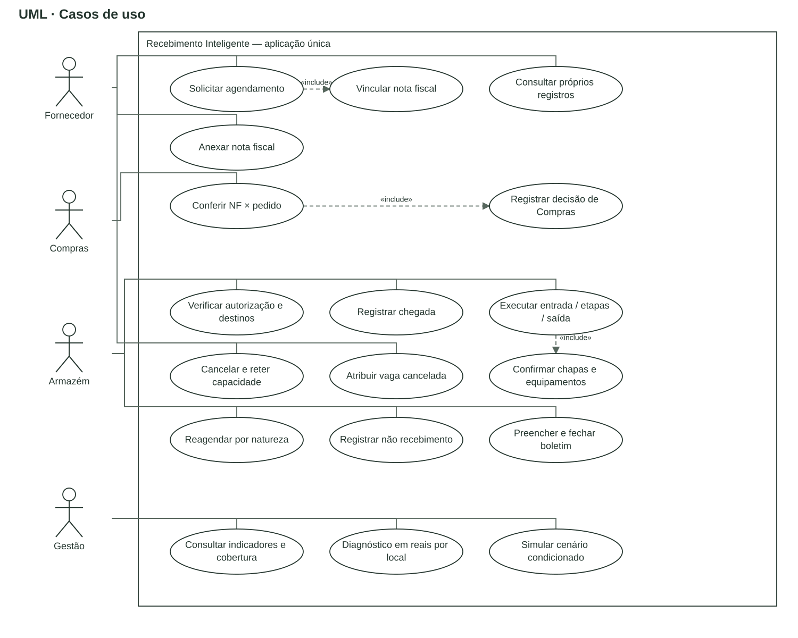

> **Documento v1 preservado.** Consulte os [casos de uso v2](v2/casos_uso.md) para os perfis e responsabilidades atuais.

# Casos de uso UML

Fonte editável: [casos-uso.drawio](fontes/casos-uso.drawio). A fronteira é o Recebimento Inteligente. Associações sem seta representam participação do ator. Setas tracejadas `«include»` representam comportamento obrigatório invocado pelo caso de uso; não representam sequência temporal.

| Ator | Interações |
|---|---|
| Fornecedor | Anexar NF, solicitar agendamento, consultar os próprios documentos e situação, cancelar o próprio agendamento antes da entrada |
| Compras | Conferir NF contra pedido/referência explícita; registrar decisão/evidência e manter pendência quando não resolvido |
| Armazém | Verificar autorização e confirmar destinos; registrar chegada, entrada, etapas e saída; confirmar recursos; cancelar/reter e atribuir vaga; reagendar por natureza; registrar não recebimento; preencher e fechar boletim |
| Gestão | Consultar indicadores/cobertura, diagnóstico por local/período em reais e cenário condicionado |
| Administrador local | Executar as ações autorizadas e provisionar contas de demonstração por comando; não existe CRUD genérico de IAM |

O fornecedor é isolado por vínculo de cadastro. Compras e armazém são decisões reais do backend. A chegada não depende de aprovação; a entrada depende de ambas as validações, chegada e destinos. Um não recebimento pode existir sem agendamento. Cancelamento cria retenção; a atribuição posterior é um caso de uso distinto e explícito do responsável.

Anexar a nota e solicitar o agendamento são casos separados. Solicitar o agendamento inclui obrigatoriamente vincular uma nota privada, que pode já existir; o diagrama não obriga novo upload a cada solicitação.

Boletim inclui produção nas três modalidades e participantes por matrícula/fração. Fechamento usa o cálculo do backend e congela preços/piso; reabertura conserva a revisão anterior. Gestão consulta somente os registros autorizados e separados por origem. Importação privada é comando de operação interna, não uma integração SAP ou publicação de dados.

Fontes: regulamento B, pp.1–3; dossiê §§4 e 8; implementação dos módulos `receiving`, `labor`, `analytics` e `core`. Autenticação e autorização são pré-condições, sem expansão de IAM.
