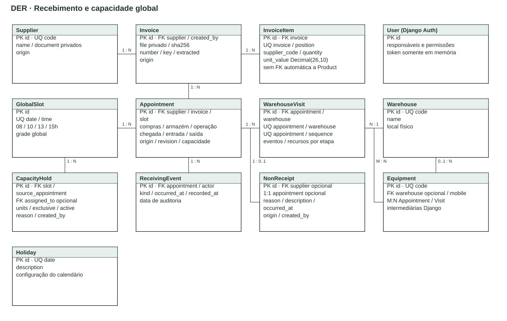
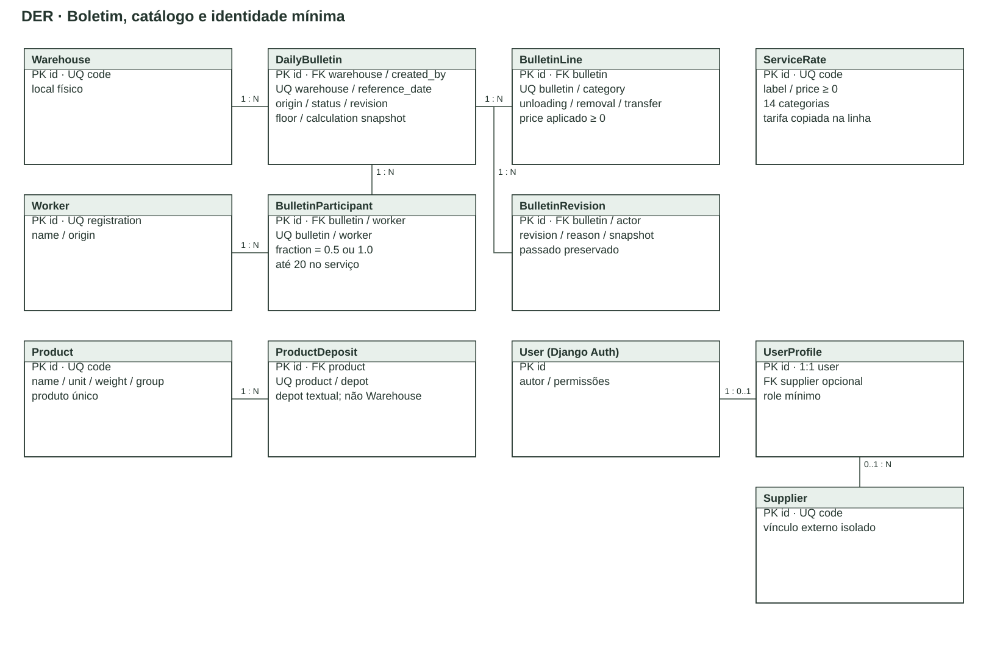
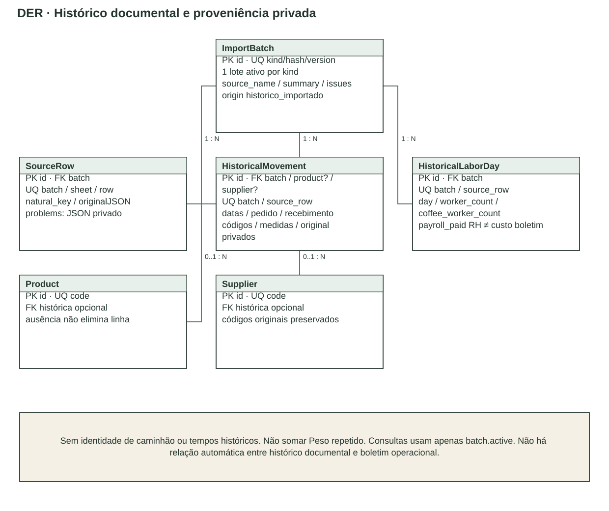

# DER — modelo efetivamente implementado

Fonte editável multipágina: [der.drawio](fontes/der.drawio). As imagens mostram as relações principais com cardinalidades da versão anterior ao seed completo. A tabela abaixo inclui o esquema privado ampliado e corresponde aos modelos/migrations Django. Tabelas geradas automaticamente por Django Auth, token e relações M:N são identificadas; não há entidade ERP fictícia.

| Entidade | Chaves e relações relevantes |
|---|---|
| User / UserProfile | User é Django Auth; profile é 1:1, com papel e FK opcional Supplier |
| Supplier | Código único; relação 1:N com Invoice e Appointment; identificação privada |
| Warehouse | Código único; 1:N Equipment, WarehouseVisit e DailyBulletin |
| Depot | Código de depósito único; FK opcional Warehouse; 1:N HistoricalStock; códigos textuais dos cadastros/movimentos são conservados |
| Equipment | Código único, finalidade e mobilidade que aceita nulo; FK opcional de local-base; M:N Appointment e WarehouseVisit pelas tabelas intermediárias Django |
| Product | Código único e atributos; 1:N ProductDeposit; 1:N HistoricalMovement com FK histórica opcional |
| ProductDeposit | Par produto/depósito único; depósito é código textual do sistema, não local físico automático |
| Worker | Matrícula única; 1:N BulletinParticipant; nome recuperado do cadastro |
| Holiday | Data única, configurável |
| GlobalSlot | Data/horário únicos globalmente; 1:N Appointment e CapacityHold |
| Invoice | FK Supplier e User; arquivo/hash privados; metadados/extração; 1:N InvoiceItem e Appointment |
| InvoiceItem | Posição única por Invoice; código do fornecedor, não FK automática Product; quantidade Decimal(22,6) e preço unitário Decimal(26,10), preservando dez casas de vUnCom |
| Appointment | FKs Supplier, Invoice, GlobalSlot e responsáveis User; status de Compras/armazém/operação independentes; eventos e recursos |
| WarehouseVisit | FKs Appointment e Warehouse; pares agendamento/local e agendamento/sequência únicos; etapas e recursos |
| CapacityHold | FK GlobalSlot; Appointment de origem e FK opcional de destinatário; unidades/exclusividade/atividade |
| ReceivingEvent | FKs Appointment e User; tipo, horário ocorrido/registrado e dados da trilha |
| NonReceipt | Relação opcional 1:1 Appointment; FK opcional Supplier; motivo e autor; aceita ocorrência avulsa |
| ServiceRate | Categoria única, tarifa não negativa |
| DailyBulletin | Par Warehouse/data único; origem/status/revisão/piso; cálculo congelado, autor e SourceFile opcional |
| BulletinLine | Categoria única por boletim; descarga/remoção/transferência/preço não negativos; preço aplicado preservado |
| BulletinParticipant | Par boletim/matrícula único; fração `1.0` ou `0.5`; até 20 validado pelo serviço |
| BulletinRevision | FK DailyBulletin e User; snapshot/revisão/motivo preservados na reabertura |
| SeedRun | Versão única; manifesto/hashes/resultado privados e conclusão da carga completa |
| SourceFile | Par SeedRun/caminho relativo único; arquivo/hash/tamanho privados; FK opcional Invoice; 1:N ImportBatch e DailyBulletin |
| ImportBatch | Tipo/fonte/hash/versão únicos; um lote ativo por tipo/fonte; FK SourceFile opcional; lotes anteriores usam fonte vazia |
| SourceRow | FK ImportBatch; aba/linha únicas; identidade natural, valores originais e motivos de pendência `problems` privados |
| HistoricalMovement | FK ImportBatch; linha única por lote; FKs Product/Supplier opcionais; códigos originais, datas documentais e medidas privadas |
| HistoricalLaborDay | FK ImportBatch; linha única por lote; data/presença global/pagamento RH privados; não é boletim |
| HistoricalStock | FKs ImportBatch/Depot e Product opcional; aba/linha únicas por lote; código original e quantidade decimal; data desconhecida fica nula |
| HistoricalWorkerDay | FK ImportBatch e Worker opcional; aba/linha/coluna únicas por lote; identificador anonimizado, data declarada, valor original e pendências; `usable` separa observações não duplicadas e sem conflito |

Todos os modelos do domínio usam UUID, exceto User/Profile e infraestrutura Django. Exclusão é protegida para registros de negócio/referências; itens e participantes internos usam cascata somente como parte do agregado. O aplicativo não expõe exclusão de fontes originais.

Capacidade é verificada com bloqueio/transação no serviço, não apenas com cardinalidade. Agenda não replica grade por local. A linha histórica não é caminhão; não possui timestamps de chegada/entrada/saída. O importador preserva referências ausentes e seleciona versão ativa, evitando multiplicação de dados ou mistura de versões. Consulte [importacao.md](importacao.md).
