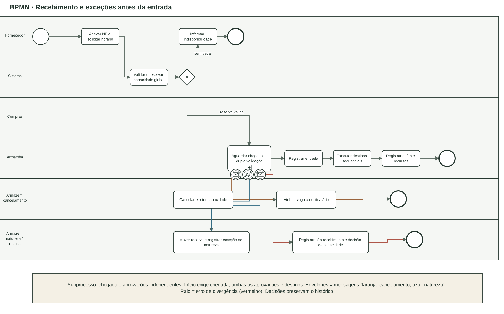
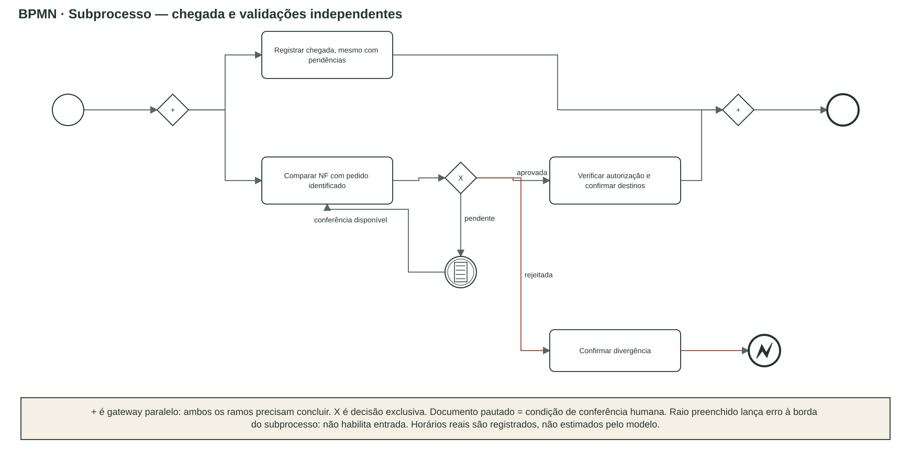

# Processo de recebimento em BPMN 2.0

Fontes editáveis: [BPMN 2.0 com BPMN DI](fontes/recebimento.bpmn) e [draw.io](fontes/recebimento-bpmn.drawio). A fonte `.bpmn` declara processos, tarefas, gateways, eventos, fluxos de sequência, raias e coordenadas. É modelo documental `isExecutable=false`; não afirma implantação em um motor de workflow.

A fonte foi validada estruturalmente contra [BPMN20.xsd oficial da OMG](https://www.omg.org/spec/BPMN/20100501/BPMN20.xsd), incluindo os schemas Semantic/BPMNDI/DC/DI. Isso verifica a estrutura BPMN; os testes do backend verificam o comportamento de negócio.

O evento inicial representa a solicitação do fornecedor. Após NF e solicitação, o sistema valida calendário e capacidade global. O gateway exclusivo encaminha a reserva válida; indisponibilidade não inicia descarga. Se houve chegada avulsa sem vaga, o armazém registra não recebimento.

O subprocesso de espera mantém **dois ramos paralelos**: chegada e validações. Compras compara a nota com pedido identificado e registra sua decisão. Pendência continua aguardando uma conferência humana; divergência encerra como não recebimento. O armazém verifica autorização e define destinos. A sincronização exige chegada e validações; não proíbe que a chegada aconteça antes delas.

Eventos de cancelamento ou natureza são tratados antes da entrada. Cancelamento retém capacidade até o responsável atribuir a vaga a um destinatário. Reagendamento por natureza move origem/destino atomicamente e preserva exceção/motivo. Não há cancelamento ou pausa da descarga após a entrada.

Com pré-condições cumpridas, registram-se entrada, etapas sequenciais nos locais e saída/recursos. A descarga iniciada termina no mesmo dia, podendo avançar após o expediente normal. Zero chapas/nenhum equipamento é valor explicitamente confirmado, não omissão. Um caminhão com vários destinos continua uma carga no total global.

Legenda BPMN: círculo fino = início; círculo duplo = evento intermediário/borda; círculo espesso = fim; retângulo arredondado = tarefa; retângulo com `+` inferior = subprocesso; losango `X` = decisão exclusiva; losango `+` = bifurcação/sincronização paralela. Envelope vazio = recebimento de mensagem; nas bordas, laranja identifica cancelamento e azul identifica natureza. Raio vazio = captura do erro de divergência; raio preenchido no fim do detalhe = lançamento desse erro. Documento pautado = evento condicional que aguarda conferência humana. Esses marcadores correspondem às definições `messageEventDefinition`, `errorEventDefinition` e `conditionalEventDefinition` da fonte. Fluxo de sequência é seta contínua. Os eventos de borda interrompem a espera e preservam o histórico.

As exceções diagramadas descrevem os contratos mínimos do aplicativo e as hipóteses conservadoras registradas em [hipoteses.md](hipoteses.md). Não representam processo validado pela Cocapec. Fontes: regulamento B, pp.1–2; dossiê §§4, 7 e 9.
