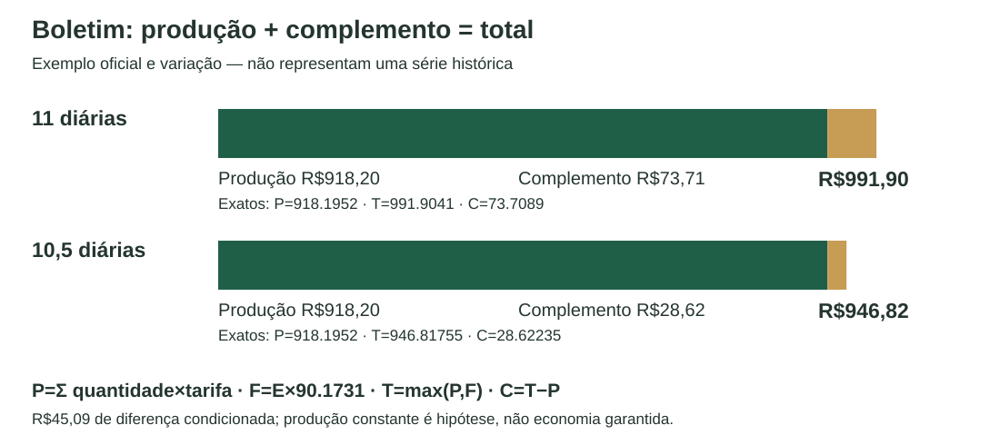

# Relatório gerencial — dimensionamento da equipe

**Conclusão que a evidência permite:** o complemento mostra quanto a remuneração da equipe ultrapassou o valor de produção lançado. Ele ajuda a selecionar dias e locais para investigação, mas não comprova ociosidade. Para decidir se falta ou sobra equipe, deve ser confrontado com espera, recusas, simultaneidade, trabalho dos cooperados e cobertura dos registros. O histórico entregue não contém série de boletins por armazém nem tempos medidos; não permite calcular uma economia real de redução de equipe.

## Método e conferência em reais

Por boletim e local, `P = Σ[(descarga + remoção + transferência) × tarifa]`, `E = Σ frações de diária`, `F = E × 90.1731`, `T = max(P,F)` e `C = T − P`. Primeiro calcula-se o piso por boletim; depois somam-se `P`, `E`, `T` e `C` no período. Matrículas distintas medem pessoas; frações medem diárias equivalentes. A equipe por descarga mede intensidade e não é somada como efetivo diário.

O custo é `T`, sem encargos ou equipamentos. R$180,00 e as diárias de RH não substituem o piso do boletim. Usam-se decimais exatos no servidor; valores apresentados em reais recebem arredondamento a centavos somente ao final.

| Origem e local | Pessoas | E | P exato | T exato | C exato | C exibido |
|---|---:|---:|---:|---:|---:|---:|
| Exemplo oficial, Adubo, 17/11/2025 | 11 | 11 | 918.1952 | 991.9041 | 73.7089 | R$73,71 |
| Variação oficial com uma meia diária, mesmo exemplo | 11 | 10,5 | 918.1952 | 946.81755 | 28.62235 | R$28,62 |

Produção: `(2378 + 400 + 30 + 40) × 0.3224 = 918.1952`. No exemplo de 11 diárias, o complemento representa aproximadamente 7,43% do total. Na variação, 3,02%. Essas proporções descrevem o exemplo; não representam o histórico da cooperativa.

O texto do dossiê informa `45.0786` para meia diária, enquanto metade de `90.1731` é `45.08655`. A implementação segue `E × 90.1731`, coerente com a fórmula da planilha e os dois exemplos. A divergência permanece documentada, sem atribuir uma correção à Cocapec.

## Consulta por local e período

O painel apresenta os quatro locais físicos — Insumos, Adubo, Pátio de Máquinas e Loja — com filtro de período e de origem. Apenas boletins fechados entram no custo consolidado. O retorno apresenta produção, diárias equivalentes, total, complemento, participação do complemento, pessoas distintas e número de boletins. A existência de dados no período é informada por local; ausência de boletim não é custo zero.

**Demonstração sintética:** os registros criados por `seed_demo` têm origem `demo_sintetico`, matrículas e fornecedores artificiais. Servem para conferir os fluxos e o diagnóstico nos quatro locais. Não são produção, recebimentos ou tempos reais da Cocapec. Os números abaixo descrevem exclusivamente o seed de 01–02/10/2026, com tarifas do boletim e equipe disjunta entre locais. A resposta econômica do cenário permanece separada do diagnóstico observado.

| Local, origem `demo_sintetico` | Boletins | Diárias equivalentes | Produção | Total | Complemento |
|---|---:|---:|---:|---:|---:|
| Adubo | 2 | 10 | R$967,20 | R$1.031,19 | R$63,99 |
| Insumos | 2 | 8 | R$709,28 | R$812,05 | R$102,77 |
| Loja | 2 | 6 | R$440,31 | R$575,35 | R$135,04 |
| Pátio de Máquinas | 2 | 4 | R$96,72 | R$360,69 | R$263,97 |
| Total do seed no período | 8 | 28 | R$2.213,51 | R$2.779,28 | R$565,77 |

Totais exatos antes da apresentação: `P=2213.5100`, `T=2779.2796`, `C=565.7696`. Foram conferidos contra os oito boletins fechados no PostgreSQL e o cálculo agregado do backend, com 14 matrículas distintas, 28 diárias equivalentes e cinco boletins abaixo do piso. O cenário foi construído para incluir produção abaixo e acima do piso. O Pátio de Máquinas apresenta complemento nos dois dias; Adubo, Insumos e Loja o apresentam somente no primeiro. Isso exercita a aplicação de `max(P,F)` por boletim antes da soma. Não permite afirmar sobra ou falta real de equipe em qualquer desses locais. Os valores devem ser conferidos no painel com o mesmo período/origem. Arredondamentos independentes de parcelas podem produzir diferenças de um centavo na soma visual.

O relatório não transforma o único boletim preenchido em uma série. O seed pode reproduzir seu contrato matemático como teste identificado; isso não aumenta a cobertura histórica.

## Cenário condicionado

Uma redução de diárias conserva a produção lançada apenas como hipótese. O cenário calcula a diferença entre `Σmax(P,90.1731 × E_atual)` e `Σmax(P,90.1731 × E_cenário)` e apresenta o resultado como diferença monetária condicionada.

No exemplo oficial, mudar de 11 para 10,5 diárias produziria diferença exata de `45.08655`, exibida como **R$45,09**. Isso depende de manter a mesma produção, atender a demanda, garantir os recursos e não transferir trabalho ou custo para outro local. Não é economia garantida. O compartilhamento da equipe com carregamento de cooperados limita qualquer conclusão isolada do recebimento.

A grade normal permite oito caminhões por dia se todos forem paletizados/big bag, ou quatro se todos forem batidos. O pico declarado de cerca de quinze caminhões sugere tensão que deve ser discutida com atendimento e recusas/postergações; uma redução de custo sem nível de serviço não demonstra melhoria.

## Origem, cobertura e inconsistências

| Fonte | O que sustenta | O que não sustenta |
|---|---|---|
| Movimentação documental | Frequência de documentos e itens por data/depósito, sazonalidade documental | Identificação automática de caminhões, tempos ou quantidade física agregada sem semântica confirmada |
| Catálogo | Produto único e associação de produto com vários depósitos | Correspondência 1:1 entre depósito e local físico ou entre códigos XML e códigos internos |
| CSV de mão de obra | Presença global por data e pagamento de RH como origem privada | Frações, produção, rateio por local ou custo do boletim |
| Boletim preenchido | Contrato de cálculo e um exemplo oficial | Série de custos por local/período |
| XMLs de NF-e | Formato, extração segura e dados declarados pelo emitente | Amostra proporcional de demanda ou correspondência automática de itens |
| Novo aplicativo | Eventos e boletins efetivamente registrados com origem e responsáveis | Reconstrução retroativa de eventos que não foram medidos |
| Seed | Testes de fluxo, persistência, indicadores e cenário | Evidência da operação real |

Os importadores conservam cada linha, arquivo/hash/versão/aba/posição e valores originais em armazenamento privado. Referências ausentes ficam pendentes e não são excluídas por `INNER JOIN`. Produto/depósito tem granularidade própria, evitando multiplicação de linhas. `Peso` repetido por pedido não é somado. Quantidade não vira demanda recebida sem confirmação de sua semântica.

Agosto e dezembro de 2025 estão ausentes da mão de obra; janeiro é parcial. Lacunas não são preenchidas com zero. Arquivos com outro hash ficam como versões inativas; somente um lote ativo de cada conjunto entra na consulta. A API de qualidade expõe contagens e limites, sem linhas, códigos, nomes, documentos ou hashes privados.

Tempos do dossiê são estimativas declaradas. Cinco minutos por palete/big bag representam o ciclo completo; não somamos novamente a retirada do caminhão. Essa referência não é aplicada à carga batida nem apresentada como medição.

## Fontes e estado de validação

Fontes locais: regulamento, seção B, pp.1–3, seção H, p.6 e L, p.7; dossiê, §§4–11, pp.3–11; LEIA-ME integral; boletim original, tabela e exemplo preenchido. O relatório usa somente resultados não identificáveis e fontes de demonstração rotuladas. Não publica arquivos originais, nomes, CNPJ, chaves fiscais ou folha.

O seed completo passou em 105 testes PostgreSQL, lint e checks, com carga dos 938 arquivos reais em banco descartável. Na rodada anterior, sete testes de apresentação, Compose, build e sincronização passaram. Os valores sintéticos acima e a importação privada foram reconciliados sem sobrescrever a operação. O APK atual passou em login, consulta e chegada refletida na web; checkpoint e reinício API/PostgreSQL preservaram o estado. O [relatório de validação](validacao.md) distingue esses resultados da asserção Maestro do alerta de conexão, que falhou no seletor embora a inspeção visual/estado confirmasse erro sem gravação. Aparelho físico não foi testado; iOS permanece **NOT RUN**. Índice, quatro artefatos e imagens foram abertos no GitHub em 03/10/2026: **PASS**. Não se trata de certificação de produção.
