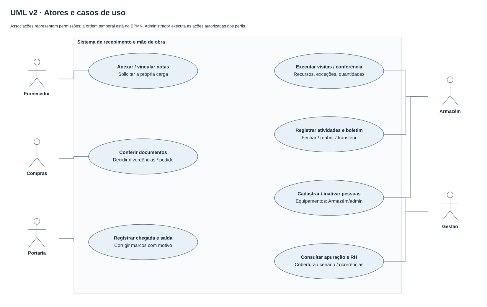

# Casos de uso UML — versão v2

Fonte editável: [casos-uso-v2.drawio](../fontes/casos-uso-v2.drawio). Associações mostram permissões e objetivos; não descrevem ordem temporal. Administrador pode executar as ações autorizadas dos demais perfis; autenticação/perfil válido são pré-condições.

| Ator | Casos de uso implementados |
|---|---|
| Fornecedor | Anexar notas privadas, solicitar/consultar a própria carga com várias notas, corrigir dados permitidos e cancelar antes da descarga |
| Compras | Conferir documentos, aprovar/recusar, registrar pedido confirmado e decidir divergências item a item |
| Portaria | Registrar chegada e saída da unidade; corrigir seus marcos com motivo; informar atraso/ausência/acesso; consultar prontidão local; criar e consultar os próprios avisos avulsos com foto e sugestão OCR conferida |
| Armazém | Confirmar destinos, registrar visitas e recursos, conferir itens, tratar cancelamento/reagendamento/recusa; consultar avisos com foto e dar ciência; usar calendário/relatório diário; registrar atividades, cadastrar/inativar pessoas/equipamentos e fechar/reabrir/transferir boletins |
| Gestão | Consultar custos e parcelas, atividades e cobertura; consultar RH histórico com procedência; comparar períodos/cenários; resolver ocorrência comprovadamente não aplicável |
| Administrador | Ações autorizadas dos perfis, além de administração técnica existente; não se pressupõe novo sistema de IAM completo |

Portaria não consulta pessoas, remuneração nem folha. O fornecedor é isolado pelo vínculo de cadastro. Gestão não altera o boletim operacional por conveniência; a alteração cabe a Armazém/admin. Resolver uma ocorrência não inventa uma regra de fração excepcional.

O aviso fotográfico não é um recebimento: comunicar chegada por foto e registrar a chegada de uma carga agendada são ações distintas, sem conversão automática. A Portaria vê somente os próprios avisos e fotos; Armazém/admin consultam o conjunto autorizado e registram ciência. A reconciliação preserva os nomes de papel `portaria` da v1 e `gatehouse` da v2 com o mesmo limite de acesso. O diagrama mostra os objetivos centrais; estes casos complementares estão detalhados no texto e na [API](api.md).

Conferir uma carga inclui cobrir todas as notas e itens; decisão de divergência por Compras é condicional. A aprovação de Compras e a confirmação dos destinos são condições de início da visita, mas não condições da chegada à Portaria. Finalizar a descarga e registrar saída da unidade são casos distintos.

Uma atividade pode atender diversos locais ao longo do dia; a parcela financeira continua vinculada a um único responsável. Consultar o histórico do RH é um caso distinto de consultar apuração do boletim, sem inferir equivalência ou executar pagamento.

Integrações opcionais não são atores confirmados em operação. O código contém adaptadores/configuração para assistente, OCR, clima e entrega externa, mas disponibilidade depende do ambiente. Os testes locais e os provedores externos têm estados de validação separados em [validacao.md](../validacao.md).
