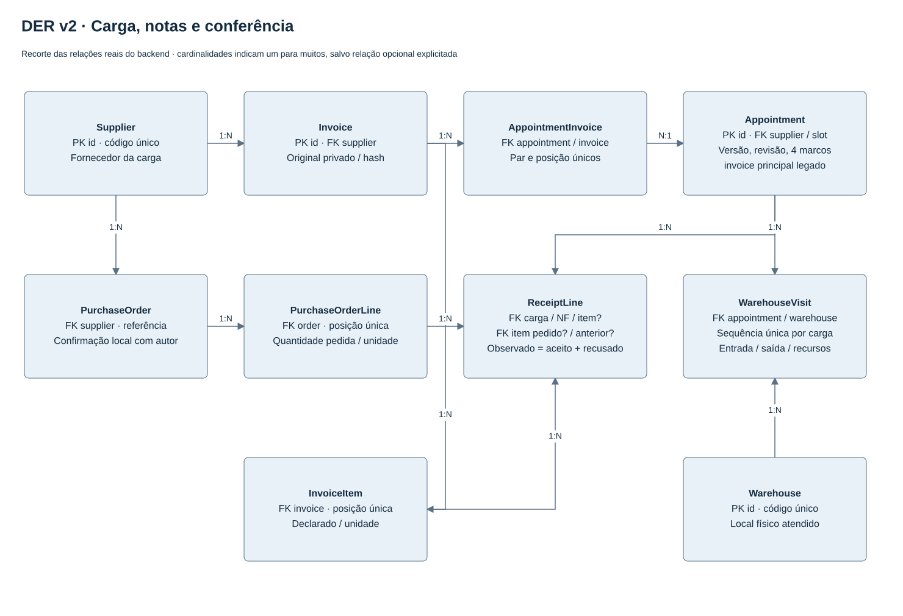
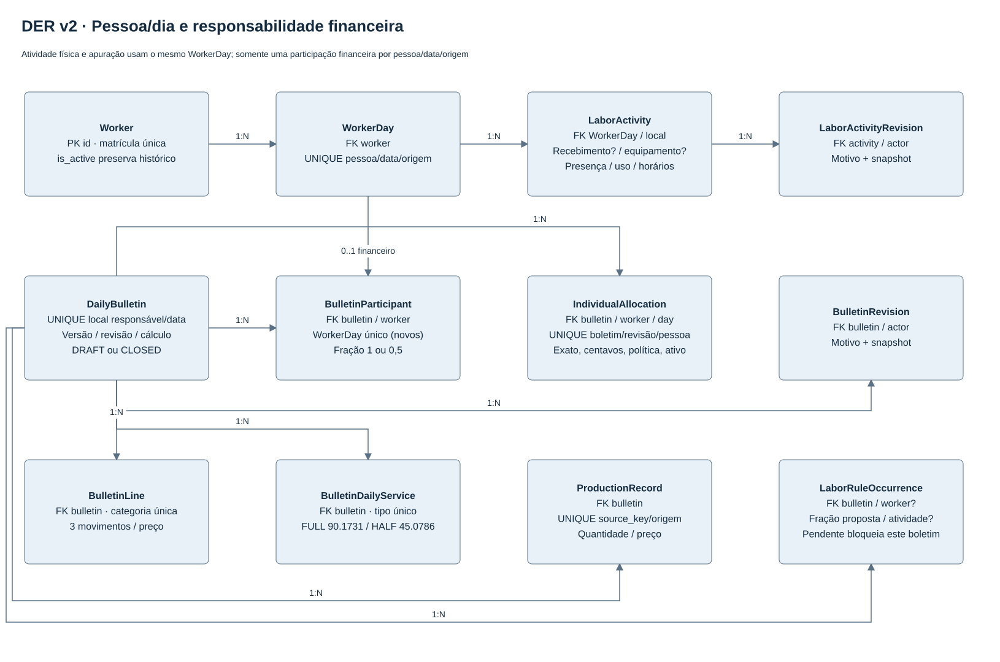

# DER — versão v2 implementada

Fonte editável: [der-v2.drawio](../fontes/der-v2.drawio), com duas páginas. Os diagramas são recortes das relações implementadas, não cópia de todas as colunas. O [DER anterior](../der.md) conserva catálogos e proveniência privada que continuam válidos. Não existe entidade ou integração ERP presumida.

| Agregado | Relações e garantias atuais |
|---|---|
| Appointment | Um fornecedor e horário global; conserva `invoice` principal para legado e agrega várias notas por AppointmentInvoice; versão do fluxo, quatro marcos, revisão e responsáveis |
| AppointmentInvoice | Relação entre recebimento e nota; pares recebimento/nota e recebimento/posição únicos |
| Invoice / InvoiceItem | Documento privado e seus itens; uma nota pode participar de cargas distintas; posição única por documento |
| WarehouseVisit | Um recebimento/local; sequência única por recebimento; entrada/saída, recursos e marcos legados preservados |
| ReceiptLine | Recebimento, nota, item opcional, item de pedido confirmado opcional e linha anterior opcional; observado = aceito + recusado; decisão e responsáveis |
| PurchaseOrder / PurchaseOrderLine | Pedido confirmado localmente por fornecedor/referência; itens positivos e unidade explícita; saldo obtido de recebimentos aceitos |
| ReceivingCommand | Comando idempotente por recebimento/chave; ação, conteúdo e ator conferidos |
| ReceivingEvent / ReceivingException | Trilhas de eventos e ocorrências com horário ocorrido e registrado; não substituem uma recusa formal |
| InternalNotification | Destinatário por perfil, chave de deduplicação e ciência; não significa mensagem externa enviada |
| CapacityHold / GlobalSlot | Retenção explícita após cancelamento; capacidade global protegida por transação |
| Worker / Equipment | Cadastros com `is_active`; inativação não rompe referências anteriores |
| WorkerDay | Chave única pessoa/data/origem; eixo compartilhado pela atividade física e apuração |
| BulletinParticipant | Fração 1 ou 0,5 e pessoa; novos registros têm WorkerDay 1:1; referências legadas podem permanecer nulas |
| LaborActivity | Muitas atividades por WorkerDay: local, recebimento/equipamento opcionais, presença, uso e horários; revisão própria |
| LaborActivityRevision | Autor, motivo e snapshot da correção de uma atividade |
| DailyBulletin | Local responsável/data únicos; origem, versão financeira, estado, revisão, piso e cálculo congelado |
| BulletinLine / BulletinDailyService | 14 categorias de produção e diárias de serviço FULL/HALF separadas; quantidade e preço aplicados preservados |
| ProductionRecord | Fonte identificada uma única vez por origem; um boletim financeiro; correção auditada de quantidade |
| IndividualAllocation | Boletim/pessoa/revisão únicos; WorkerDay, política, fração, valores exatos/racionais, apresentação e estado ativo |
| BulletinRevision | Histórico de fechamento, edição, reabertura, transferência e ocorrências; snapshot com autor/motivo |
| LaborRuleOccurrence | Regra indefinida, pessoa/fração proposta/atividade/horários opcionais; resolução/política/autor sem aplicação automática da proposta |
| HistoricalWorkerDay / ImportBatch | Observação de RH e procedência; somente lotes ativos entram na consulta; qualidade conserva observações não utilizáveis |

A migração adiciona estruturas e marca os boletins existentes como `boletim-v1`. Não recalcula fechados, cria parcelas retroativas nem inventa os quatro horários. A API de novos boletins grava `boletim-v2`. Separar `active` de exclusão conserva parcelas de revisões reabertas para auditoria.

Os modelos opcionais de `integrations` também existem: WarehouseReadiness/ReadinessRevision, ReceiptSignature, DocumentSuggestion e OutboundDelivery. Eles armazenam prontidão, manifestação de aceite, original/sugestão OCR e entrega externa. A existência dessas tabelas não comprova que um provedor foi configurado ou que um envio ocorreu.

Os arquivos nativos foram produzidos em XML draw.io e as imagens pelo mesmo grafo de dados. O Desktop/CLI não estava instalado; não há alegação de exportação ou inspeção pelo aplicativo Draw.io. Fontes originais v1 foram preservadas.
