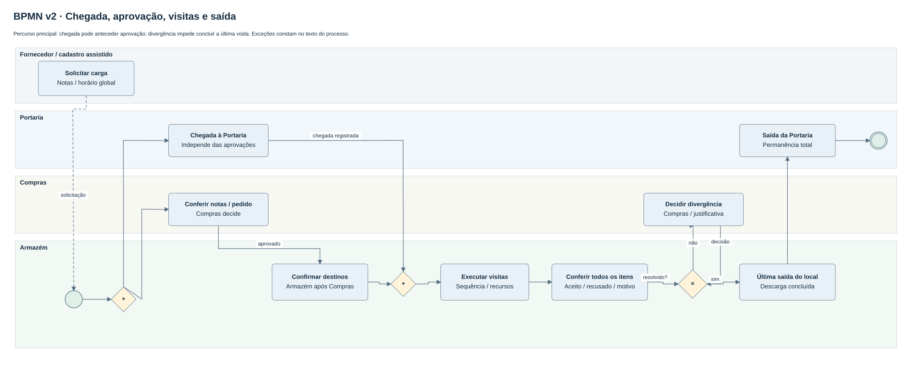

# Processo de recebimento v2

Fontes: [draw.io](../fontes/recebimento-bpmn-v2.drawio) e [BPMN 2.0](../fontes/recebimento-v2.bpmn). O diagrama apresenta o percurso principal; as exceções abaixo completam o contrato. Os estados e responsáveis são verificados no servidor.

1. Fornecedor ou operador autorizado anexa as notas e solicita um horário global. Cada carga reúne de 1 a 30 notas do mesmo fornecedor. Cadastro assistido e chegada espontânea ficam identificados. Batida e máquina/implemento exigem horário exclusivo.
2. Compras confere documentos/pedido e decide; Armazém confirma os destinos após a aprovação de Compras. Em paralelo, a Portaria pode registrar a chegada física. Chegada não prova autorização para descarregar.
3. Com chegada registrada, dupla aprovação e reserva válida, Armazém registra entrada no primeiro local. As visitas são sequenciais, com entrada/saída e recursos confirmados em cada uma.
4. Armazém registra o observado, aceito e recusado por nota/item. Divergência suspende a conclusão até decisão documentada de Compras. Todos os itens precisam ser conferidos; notas manuais têm ao menos uma linha.
5. A saída da última visita conclui a descarga. Portaria registra a saída da unidade separadamente. O tempo dentro do local, espera inicial e permanência total resultam de pares diferentes de eventos.

## Exceções e trilha

Cancelamento anterior à descarga registra motivo e retém capacidade; a vaga não é liberada silenciosamente ao público. Atribuição a outro recebimento é uma ação nominal. Reagendamento por natureza usa justificativa, capacidade/transação e preserva chegada já observada. Não recebimento pode estar ligado a uma carga ou ser avulso.

Atraso, não comparecimento, natureza e outras ocorrências têm horário ocorrido/registrado e responsável. Não comparecimento não pode ser registrado antes do horário reservado nem após chegada. A ocorrência não vira automaticamente uma recusa nem cria capacidade.

No recebimento parcial, a NF declara uma quantidade, a conferência aceita/recusa outra e o pedido confirmado pode possuir saldo próprio. Esses três números não são intercambiáveis. Uma nova entrega pode vincular uma linha anterior e o mesmo item de pedido, quando existente; sem confirmação do pedido, não se presume seu saldo. Unidades precisam coincidir.

Alteração documental/acondicionamento exige nova aprovação aplicável. Correção de horário exige motivo, mantém sequência cronológica e registra trilha. Revisão esperada e chave de idempotência evitam sobrescrita e repetição de efeitos. Notificação interna informa o perfil destinatário; não se presume envio por WhatsApp, e-mail ou calendário.

## Fluxo financeiro paralelo

As atividades individuais registram presença prevista, presente/ausente, uso, máquina e locais atendidos. A mesma pessoa pode trabalhar em vários locais e recebimentos. Seu vínculo financeiro da data fica em um único boletim, com responsável explícito pelo custo.

O boletim reúne produção das três modalidades, diárias de serviço e fontes identificadas. O fechamento preserva a fórmula coletiva e grava a parcela proporcional de cada pessoa. Transferência financeira entre locais exige motivo e revisão de ambos os boletins; reabre os fechados e preserva as parcelas antigas. Atividades não são apagadas nem transferidas artificialmente com o responsável financeiro.

Fração excepcional, saída antecipada, hora extra ou diária especial fica registrada como regra pendente e impede somente o fechamento afetado. Não há cálculo definitivo dessas exceções até regra implementada; a resolução atualmente permitida apenas declara, com justificativa de Gestão/admin, que não houve impacto aplicável.

Prontidão manual, previsão do tempo, assistente e sugestão OCR não alteram automaticamente aprovação, capacidade, horário ou pagamento. A execução de pagamento não faz parte deste fluxo.
